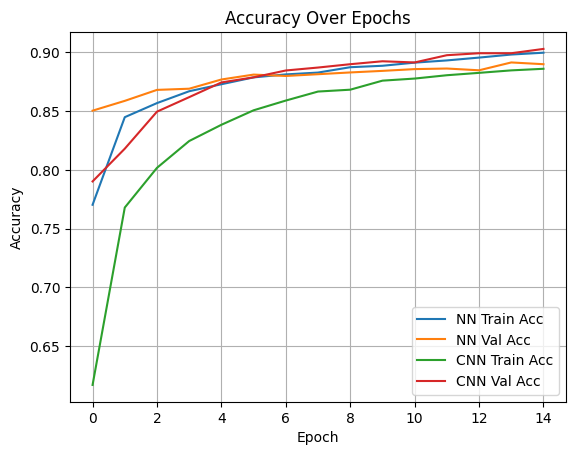
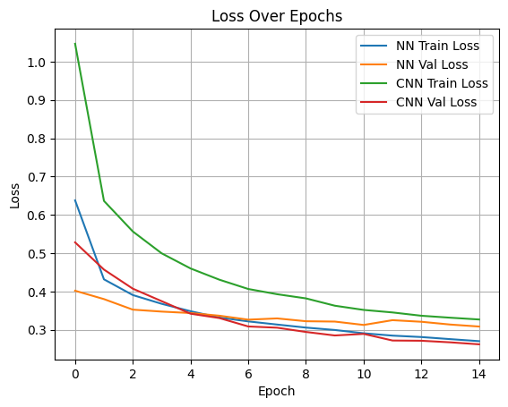
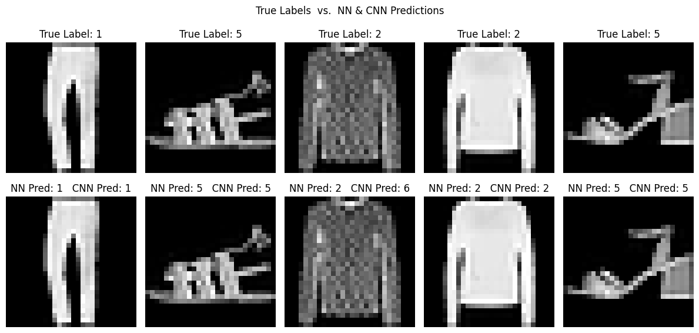

# 🧠 Image Classification: Neural Network vs CNN (Fashion MNIST)

This deep learning project compares the performance of a dense neural network and a convolutional neural network (CNN) on the **Fashion MNIST dataset** using TensorFlow/Keras.

---

## 🎯 Objective

- Classify clothing items from grayscale 28x28 pixel images
- Compare traditional NN and CNN performance on the same dataset

---

## 📦 Dataset

- Fashion MNIST dataset (from `tensorflow.keras.datasets`)
- 60,000 training samples, 10,000 test samples
- 10 clothing item categories

---

## 🧠 Models

### 1️⃣ Neural Network (NN)
- Dense(512) → Dropout(0.3)
- Dense(256) → Dropout(0.3)
- Dense(128) → Dropout(0.2)
- Output: Dense(10, softmax)

### 2️⃣ Convolutional Neural Network (CNN)
- Conv2D(32) + MaxPooling + Dropout
- Conv2D(64) + MaxPooling + Dropout
- Dense(128) → Dropout
- Dense(64) → Dropout
- Output: Dense(10, softmax)

---

## 📈 Performance

| Model | Test Accuracy |
|-------|----------------|
| NN    | 88.77%         |
| CNN   | 89.97%         |

✅ CNN outperformed NN by ~1.2%

---

## 🖼️ Visualizations

- Training vs. Validation Accuracy
- Training vs. Validation Loss
- Sample predictions (True Label, NN Prediction, CNN Prediction)

---

## 🛠️ Tech Stack

- Python
- TensorFlow / Keras
- NumPy
- Matplotlib
- Jupyter Notebook

---

## 📈 Performance Plots

### 🔹 Accuracy Over Epochs


### 🔹 Loss Over Epochs


### 🧠 Sample Predictions (NN vs CNN)



## 📦 Requirements

```bash
pip install -r requirements.txt

